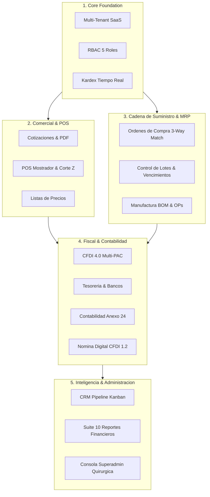

# ControlERP ⚡

> **Plataforma SaaS ERP Multi-tenant moderna de alto rendimiento** diseñada para distribución, mayoreo, retail y manufactura. Integra inventarios multialmacén con Kárdex en tiempo real, gestión estricta de crédito y cobranza (CxC/CxP), Punto de Venta (POS), Contabilidad Electrónica (SAT Anexo 24), Nómina Digital (CFDI 1.2) y preparación fiscal multi-PAC para SAT CFDI 4.0 en México.

---

[](https://nextjs.org/)
[](https://react.dev/)
[](https://www.typescriptlang.org/)
[](https://www.prisma.io/)
[](https://tailwindcss.com/)
[](https://www.docker.com/)
[](https://www.sat.gob.mx/)

---

## 📌 Tabla de Contenidos

1. [Visión General](#-visión-general)
2. [Arquitectura de Roles & RBAC](#-arquitectura-de-roles--rbac)
3. [Módulos del Sistema](#-módulos-del-sistema)
4. [Stack Tecnológico](#-stack-tecnológico)
5. [Estructura del Proyecto](#-estructura-del-proyecto)
6. [Instalación y Configuración Local](#-instalación-y-configuración-local)
7. [Despliegue en Producción (Docker / Ubuntu)](#-despliegue-en-producción-docker--ubuntu)
8. [Seguridad y Aislamiento Multi-Tenant](#-seguridad-y-aislamiento-multi-tenant)
9. [Sistema de Diseño: The Fintech Ledger](#-sistema-de-diseño-the-fintech-ledger)

---

## 🌐 Visión General

**ControlERP** resuelve de forma unificada la fragmentación operativa común en empresas de comercio, distribución y manufactura. Proporciona una arquitectura SaaS multiempresa donde cada inquilino (*Tenant*) opera en un entorno aislado con personalización de identidad corporativa, límites de crédito estrictos, trazabilidad física de almacenes y automatización contable-fiscal.

### Características Principales:
- **Aislamiento Multi-tenant Total:** Particionamiento estricto por `tenantId` en todos los modelos de datos y transacciones.
- **Kárdex Transaccional en Tiempo Real:** Valuación por Costo Promedio Ponderado, cálculo automático de existencias y bloqueo de stock negativo.
- **Motor de Crédito & Cobranza:** Validación en milisegundos de límite de crédito, días de gracia, bloqueo por morosidad y complemento REP 2.0.
- **Punto de Venta (POS):** Escaneo de código de barras, atajos de teclado, calculadora de cambio, arqueo de caja (Corte Z) e impresión térmica.
- **Contabilidad Electrónica (Anexo 24):** Generación automática de pólizas contables de partida doble para ventas, compras, cobros, pagos y nómina.
- **Nómina Digital (CFDI 1.2):** Cálculo de retenciones ISR Art. 96, cuotas IMSS, prenómina, recibos con timbrado y layouts bancarios.
- **Manufactura & MRP:** Listas de Materiales (BOM) con porcentaje de merma y órdenes de producción con costeo de insumos.

---

## 👥 Arquitectura de Roles & RBAC

El sistema implementa un control de acceso basado en roles con 5 niveles operativos:

| Rol | Alcance y Responsabilidades |
| :--- | :--- |
| **`SUPERADMIN`** | Control maestro de infraestructura SaaS, gestión global de inquilinos (*Tenants*), consola quirúrgica de activación de módulos y supervisión del clúster. |
| **`ADMIN`** | Dueño / Director general de la empresa. Configura almacenes, usuarios, políticas de crédito, listas de precios, credenciales PAC y personalización de marca. |
| **`ENCARGADO`** | Ventas de mostrador y crédito, cotizaciones, POS, consulta de cartera CxC, recepción de abonos y solicitudes de traspaso entre almacenes. |
| **`ALMACENISTA`** | Recepción de órdenes de compra (3-Way Matching), confirmación de traspasos, ajustes de stock, gestión de lotes y fechas de caducidad. *Vista restringida de costos.* |
| **`AUDITOR / CONTADOR`** | Supervisión contable y fiscal, catálogo de cuentas SAT, pólizas automáticas, balanza de comprobación, bitácora de auditoría y reportes de rentabilidad. |

---

## 📦 Módulos del Sistema



### Detalle de Módulos Implementados:

1. **Multi-Tenant SaaS & RBAC:** Gestión de organizaciones con cuotas de usuarios, almacenes y colores corporativos dinámicos.
2. **Ciclo Comercial & Cotizaciones:** Creación de presupuestos con envío de PDF por email y conversión a venta en un clic.
3. **Punto de Venta Mostrador (`/pos`):** Terminal rápida optimizada para periféricos físicos, apertura/cierre de turnos y corte de caja.
4. **Cadena de Suministro & 3-Way Match:** Conciliación estricta entre Orden de Compra, Factura de Proveedor y Recepción Física en Almacén.
5. **SAT CFDI 4.0 Multi-PAC:** Integración con Finkok, SW Sapien, Prodigia y Simulador local para Facturas de Ingreso, Recibos de Pago (REP 2.0) y Carta Porte 3.1.
6. **Tesorería & Bancos:** Cuentas multimoneda, cajas chicas, flujo de efectivo y conciliación bancaria con un clic.
7. **Manufactura & MRP:** Estructuras BOM con merma, explosión de materiales y órdenes de producción con recálculo de costo promedio ponderado.
8. **CRM Comercial:** Pipeline Kanban interactivo de oportunidades, pronóstico ponderado de ventas (Sales Forecasting) y seguimiento de clientes.
9. **Contabilidad Electrónica (SAT Anexo 24):** Catálogo con códigos agrupadores SAT, pólizas automáticas de partida doble y exportación XML.
10. **Recursos Humanos & Nómina:** Expedientes de colaboradores, cálculo de ISR/IMSS quincenal, timbrado digital y layouts bancarios de dispersión.
11. **Suite de Analítica & Reportes:** 10 paneles de inteligencia (Balanza CxC, Antigüedad de Saldos, LTV, Conciliación, Ventas por Margen, Liquidación de Comisiones con ticket térmico, etc.).
12. **Consola de Personalización Extrema (Superadmin):** Control granular para activar o desactivar más de 50 microfunciones por inquilino con 5 plantillas instantáneas (Retail, Mayorista, MRP, Full Suite, Mínimo).

---

## 🛠️ Stack Tecnológico

- **Frontend & Framework:** [Next.js 15](https://nextjs.org/) (App Router), [React 19](https://react.dev/), [TypeScript](https://www.typescriptlang.org/)
- **Estilos & UI:** [Tailwind CSS](https://tailwindcss.com/), [Lucide React Icons](https://lucide.dev/), Clsx & Tailwind-Merge
- **Base de Datos & ORM:** [Prisma ORM 6.4](https://www.prisma.io/) (Soporte dual SQLite para desarrollo / PostgreSQL para producción)
- **Autenticación & Criptografía:** JWT seguro vía [Jose](https://github.com/panva/jose) + [BcryptJS](https://github.com/dcodeIO/bcrypt.js)
- **Documentación & Salidas:** [jsPDF](https://github.com/parallax/jsPDF) + [jsPDF-AutoTable](https://github.com/simonbengtsson/jsPDF-AutoTable), [QRCode](https://github.com/soldair/node-qrcode)
- **Correos Electrónicos:** [Nodemailer](https://nodemailer.com/)
- **Validación de Esquemas:** [Zod 4](https://zod.dev/)
- **Despliegue & Contenedores:** Docker, Docker Compose, Nginx Reverse Proxy, Ubuntu Server 22.04/24.04 LTS

---

## 📂 Estructura del Proyecto

```text
ControlERP/
├── prisma/
│   ├── schema.prisma         # Esquema de datos multi-tenant (PostgreSQL / SQLite)
│   ├── seed.js               # Semilla inicial con inquilinos demo y catálogo SAT
│   └── migrations/           # Historial de migraciones
├── public/                   # Recursos estáticos, logos e íconos
├── scripts/
│   ├── switch-db.js          # Conmutador automático entre SQLite y PostgreSQL
│   ├── migrate-data-sqlite-to-pg.js # Migración de datos entre motores
│   └── e2e-simulation.ts     # Pruebas de integración E2E automatizadas
├── src/
│   ├── app/                  # Next.js App Router (Rutas, layouts y APIs REST)
│   │   ├── (auth)/login      # Autenticación y recuperación de sesión
│   │   ├── api/              # Endpoints transaccionales seguros
│   │   ├── almacenes/        # Gestión física y multialmacén
│   │   ├── contabilidad/     # Catálogo de cuentas y pólizas Anexo 24
│   │   ├── cotizaciones/     # Cotizador dinámico con PDF y email
│   │   ├── crm/              # Pipeline comercial Kanban
│   │   ├── cxc/ & cxp/       # Cuentas por cobrar y pagar
│   │   ├── manufactura/      # BOM y órdenes de producción
│   │   ├── nomina/           # Módulo de nómina digital CFDI 1.2
│   │   ├── ordenes-compra/   # Compras y 3-Way Matching
│   │   ├── pos/              # Terminal Punto de Venta mostrador
│   │   ├── reportes/         # Suite analítica y reportes financieros
│   │   ├── superadmin/       # Consola de personalización SaaS
│   │   ├── tesoreria/        # Bancos, cuentas y conciliación
│   │   └── ventas/           # Facturación y timbrado CFDI 4.0
│   ├── components/           # Componentes UI reutilizables y Dashboards por Rol
│   └── lib/                  # Adaptadores fiscales, utilidades y conexión Prisma
├── Dockerfile                # Configuración de compilación multi-etapa
├── docker-compose.yml        # Orquestación de app + base de datos PostgreSQL
└── package.json              # Dependencias y scripts de ejecución
```

---

## 🚀 Instalación y Configuración Local

### Prerrequisitos
- Node.js 20.x o superior
- npm 10.x o superior

### 1. Clonar el repositorio
```bash
git clone https://github.com/tu-usuario/ControlERP.git
cd ControlERP
```

### 2. Instalar dependencias
```bash
npm install
```

### 3. Configurar variables de entorno
Crea un archivo `.env` en la raíz del proyecto:
```env
DATABASE_URL="file:./dev.db"
JWT_SECRET="tu-clave-secreta-jwt-super-segura"
PORT=3222
NEXT_PUBLIC_APP_URL="http://localhost:3222"

# Configuración de Correo (Opcional para cotizaciones)
SMTP_HOST="smtp.gmail.com"
SMTP_PORT=587
SMTP_USER="tu-correo@gmail.com"
SMTP_PASS="tu-contraseña-de-aplicacion"
```

### 4. Inicializar base de datos y datos de prueba
```bash
# Generar cliente de Prisma
npm run prisma:generate

# Crear tablas en SQLite local
npm run db:push

# Poblar datos demo (Inquilinos, Catálogo SAT, Usuarios y Productos)
npm run db:seed
```

### 5. Iniciar servidor de desarrollo
```bash
npm run dev
```
Abre tu navegador en [http://localhost:3222](http://localhost:3222).

---

## 🐳 Despliegue en Producción (Docker / Ubuntu)

El proyecto incluye soporte nativo para despliegue en entornos Linux (Ubuntu 22.04/24.04 LTS) mediante Docker y Docker Compose con PostgreSQL.

### 1. Despliegue con Docker Compose
```bash
# Cambiar la base de datos a PostgreSQL
npm run db:use:postgres

# Construir y levantar contenedores
docker-compose up -d --build
```

### 2. Script automatizado para Ubuntu Server
Para aprovisionar un servidor Ubuntu desde cero, utiliza el script incluido:
```bash
chmod +x setup-ubuntu.sh
./setup-ubuntu.sh
```

---

## 🔒 Seguridad y Aislamiento Multi-Tenant

- **Filtro Transaccional Obligatorio:** Toda consulta a base de datos via Prisma incorpora la cláusula `tenantId` derivada exclusivamente del token JWT validado en sesión, imposibilitando la fuga de información entre organizaciones (*Data Leaks*).
- **Control de Acceso Basado en Roles (RBAC):** Middleware y endpoints protegidos con verificación de nivel de privilegios (`SUPERADMIN`, `ADMIN`, `ENCARGADO`, `ALMACENISTA`, `AUDITOR`).
- **Bitácora Inmutable de Auditoría:** El modelo `RegistroAuditoria` guarda historial con *timestamp*, usuario, entidad afectada y valores anteriores/nuevos para operaciones críticas (modificación de límites de crédito, ajustes de existencias y cancelaciones).

---

## 🎨 Sistema de Diseño: "The Fintech Ledger"

La interfaz de usuario sigue el estándar visual corporativo definido en [`DESIGN.md`](./DESIGN.md):
- **Tipografía Fiscal y Numérica:** Folios, UUIDs SAT, SKUs, códigos de barras e importes monetarios formateados en monoespacio (`font-mono`) para alineación contable exacta.
- **Jerarquía Visual y Elevación:** Modales con `backdrop-blur-sm bg-slate-950/60` y tarjetas con profundidad táctil (`shadow-md shadow-slate-900/5`).
- **Paleta Adaptativa por Inquilino:** Integración dinámica de los colores corporativos de cada empresa sin comprometer los colores semánticos de estado (éxito, alerta, morosidad, peligro).

---

## 📄 Licencia

Este proyecto está protegido bajo derechos reservados. Para términos de licenciamiento comercial o distribución SaaS, contactar al equipo de administración.

---

<p align="center">
  Desarrollado con precisión contable, operativa y fiscal para el ecosistema empresarial moderno.
</p>
